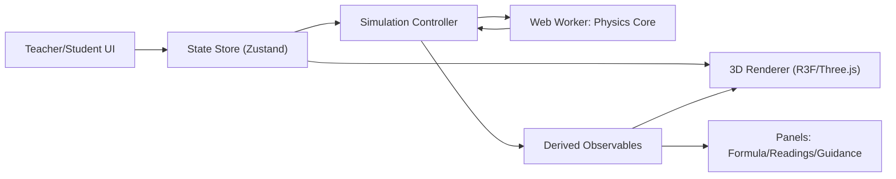

# 3D 电磁学仿真平台设计（技术栈1，目标A）

日期：2026-02-25  
状态：已确认（用户已选：技术栈1、目标A、首发场景A）

## 1. 目标与范围

### 1.1 目标（MVP）

构建一个浏览器可运行的 3D 电磁学教学演示平台，首版聚焦课堂演示与交互理解，不追求科研级数值精度。  
首版只交付两个核心场景：

1. 示波器场景（交流电波形观察）
2. 回旋加速器场景（带电粒子在电磁场中加速偏转）

平台必须支持：

1. 实时参数调节（滑块/输入框）
2. 3D 可视化（轨迹、矢量、器件模型）
3. 教学辅助（公式联动、步骤提示、关键量读数）
4. 演示控制（播放/暂停/慢放/重置）

### 1.2 非目标（首版明确不做）

1. 不做高精度有限元场求解（如 FDTD/FEM）
2. 不做题库判分系统
3. 不做多用户协作课堂
4. 不做复杂后端内容管理系统

## 2. 场景依据与优先级

基于课程标准与考试规范，电磁学高频教学/考查主题可归纳为：

1. 静电场与带电粒子运动
2. 磁场与洛伦兹力
3. 电磁感应（法拉第、楞次）
4. 交流电与示波器读数
5. 复合场装置（速度选择器、质谱仪、回旋加速器）

首版优先 `示波器 + 回旋加速器` 的理由：

1. 教学表现力强：一个覆盖波形读数，一个覆盖粒子动力学
2. 视觉对比明显：时间域波形 vs 空间轨道
3. 扩展价值高：后续新增速度选择器/质谱仪复用度高

## 3. 技术栈选型

## 3.1 栈定义（已选）

1. `TypeScript`
2. `React + Vite`
3. `React Three Fiber + Three.js`
4. `Web Worker`（物理计算与主线程解耦）
5. `Zustand`（全局状态管理）
6. `Vitest + Playwright`（单测与端到端）

可选后端（非首版必需）：`FastAPI`，用于后续保存课件模板、参数预设、教学数据。

### 3.2 选型理由

1. Web-first 部署成本低，适合课堂分享与快速迭代
2. R3F 在 React 生态内整合 3D 交互和 UI 成本更低
3. Web Worker 可保障参数拖动时界面响应性
4. TS 有利于物理量、状态结构和接口约束

## 4. 总体架构



四层拆分：

1. 场景壳层（路由、页面布局、场景切换）
2. 仿真核心层（积分器、场模型、数值约束）
3. 渲染层（3D 几何、轨迹、矢量、波形）
4. 教学层（步骤引导、公式联动、读数面板）

## 5. 模块设计

建议目录：

```text
src/
  app/
  core/
    physics/
    integrators/
    fields/
    numeric-guards/
  scenes/
    oscilloscope/
    cyclotron/
  visual/
    particles/
    vectors/
    waveforms/
  ui/
    controls/
    guidance/
    formula/
  store/
  workers/
  tests/
```

统一场景接口：

1. `init(config): SceneState`
2. `step(dt, state): SceneState`
3. `deriveObservables(state): Observables`
4. `getUIConfig(): UIConfig`
5. `getLessonSteps(): LessonStep[]`

这样后续新增场景（速度选择器、质谱仪）仅需新增 `scene + field config`。

## 6. 两个首发场景设计

## 6.1 场景一：示波器（AC Wave Lab）

### 教学目标

1. 理解周期、频率、峰值、有效值
2. 理解时基（time/div）与垂直增益（volt/div）
3. 观察相位变化对双通道波形的影响

### 交互参数

1. 信号类型：正弦（MVP）
2. 幅值 A、频率 f、相位 φ、直流偏置
3. 时基、垂直增益、触发阈值（简化）
4. 噪声开关（可选）

### 输出

1. 波形窗口（网格 + 光标）
2. 自动读数：`T`、`f`、`Vpp`、`Vrms`
3. 公式联动提示区

## 6.2 场景二：回旋加速器（Cyclotron Lab）

### 教学目标

1. 理解洛伦兹力导致圆周运动
2. 理解交变电场在缝隙加速粒子
3. 理解轨道半径随动量增长而变大

### 交互参数

1. 粒子电荷量 q、质量 m、初速度 v0
2. 磁场强度 B（匀强）
3. 缝隙电压幅值与频率（简化同步条件）
4. 注入角度与粒子数量

### 输出

1. 粒子实时轨迹
2. 速度矢量/受力矢量可视化开关
3. 实时读数：半径、周期、动能
4. 关键公式卡片（课堂模式）

## 7. 仿真与数值策略

### 7.1 时间推进

1. Worker 固定步长（例如 `dt = 1/240`）
2. 渲染 60fps 插值显示
3. 支持慢放（时间缩放）

### 7.2 积分器策略

1. MVP 使用半隐式 Euler（稳定、实现快）
2. 保留升级位到 RK4（配置切换）

### 7.3 数值保护

1. 参数白名单与范围钳制
2. 每步 NaN/Inf 检测
3. 异常即冻结并回滚到最近有效快照

## 8. 数据流设计

单向流：

1. UI 参数输入
2. 参数校验与归一化
3. Worker 执行 `N` 个物理步
4. 生成派生观测量（读数、公式变量）
5. 渲染层与教学层消费
6. 可选快照缓存（重播/回退）

性能要点：

1. 轨迹点抽稀与上限裁剪
2. 波形使用环形缓冲区
3. 渲染对象池复用，减少 GC 抖动

## 9. 容错与可观测性

三层容错：

1. 输入层：越界参数拒绝或自动回退
2. 计算层：状态异常检测 + 自动停机
3. 渲染层：对象缺失降级显示

日志建议：

1. `sim_step_time_ms`
2. `fps`
3. `worker_queue_lag`
4. `numeric_guard_trigger_count`

## 10. 测试策略

### 10.1 单元测试（Vitest）

1. 场公式与单位换算
2. 积分器稳定性
3. 示波器读数计算（`f`、`Vrms`、`Vpp`）
4. 回旋半径与理论关系趋势验证

### 10.2 集成与 E2E（Playwright）

1. 场景加载与切换
2. 参数拖动后的连续渲染不崩溃
3. 播放/暂停/重置可重复执行
4. 关键教学步骤提示可触发

### 10.3 验收指标（MVP）

1. 主流笔记本 60fps 目标（最低 45fps）
2. 两场景关键读数稳定输出
3. 无阻断级错误（白屏/死循环）

## 11. 迭代计划（建议）

1. 里程碑 M1（1 周）：工程脚手架 + Scene Shell + Worker 管线
2. 里程碑 M2（1-2 周）：示波器场景完整可演示
3. 里程碑 M3（1-2 周）：回旋加速器场景完整可演示
4. 里程碑 M4（0.5-1 周）：测试、性能优化、演示文案

## 12. 风险与应对

1. 数值不稳定导致轨迹发散  
应对：固定步长 + 范围钳制 + 快照回滚

2. UI 与仿真耦合过重导致维护困难  
应对：统一场景接口与数据契约

3. 首版范围膨胀  
应对：严格只做 2 场景，其他列入下一版本

## 13. 下一步（进入实现前）

1. 初始化工程（Vite + React + TS + R3F）
2. 先打通 Worker 仿真主循环
3. 并行构建两个场景的最小可运行版本

---

## 参考来源（检索依据）

1. 教育部课程标准发布页：<http://www.moe.gov.cn/srcsite/A26/s8001/202006/t20200603_462199.html>
2. 课程标准附件 ZIP：<http://www.moe.gov.cn/srcsite/A26/s8001/202006/W020200603315372317586.zip>
3. AQA Physics 7408 规范 PDF（含 `oscilloscope`、`cyclotron`）：<https://cdn.sanity.io/files/p28bar15/green/c84fb691cf808ff97ba17ffce6f458f837016dc9.pdf>
4. Cambridge 9702 2025-2027（含 `CRO`、`velocity selection`）：<https://www.cambridgeinternational.org/Images/664565-2025-2027-syllabus.pdf>
